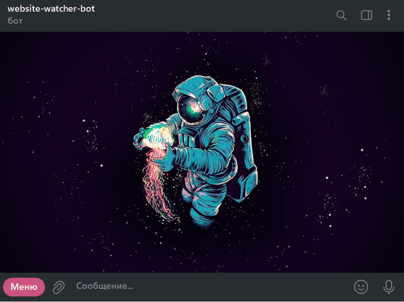
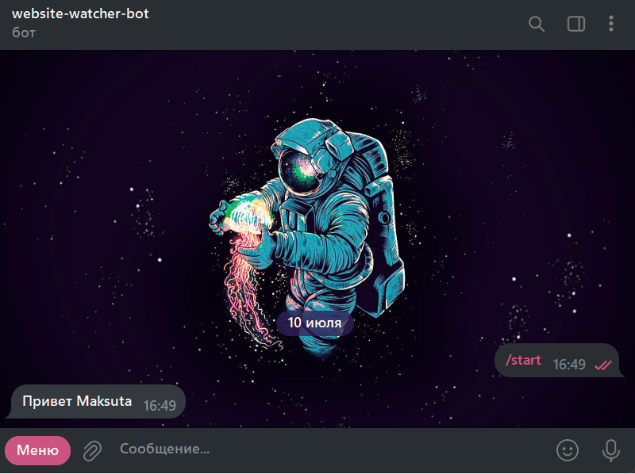
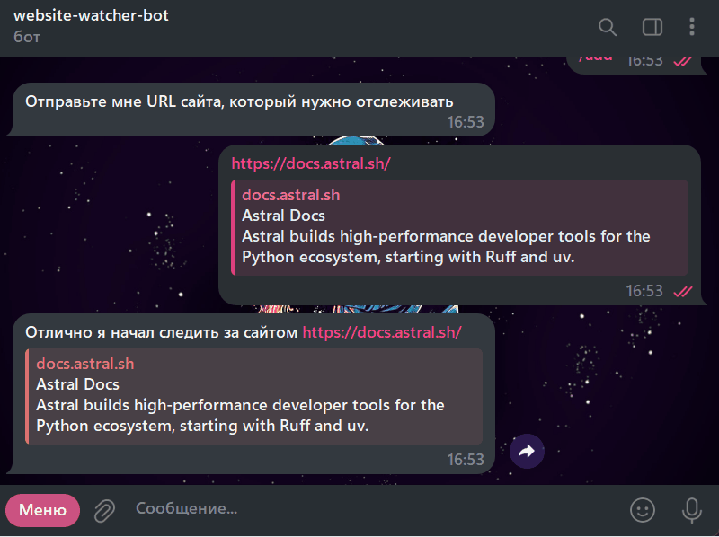
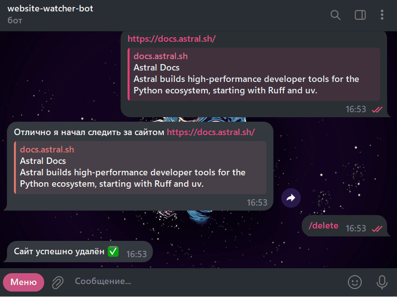

<div align="center">

  <h1>Website Watcher Bot</h1>

  <p>
    <b>Телеграм-бот для мониторинга доступности и внешнего вида сайтов с уведомлениями.</b>
    <br />
    <i>Проект создан для демонстрации навыков backend-разработки на Python с использованием асинхронных фреймворков и DevOps-практик.</i>
  </p>

  <p>
    
    
    
	
    
    
	
	
	
	
  </p>

  
</div>


---

## Демонстрация работы

*Демонстрация основных функций бота: добавление, просмотр и удаление сайтов, получение уведомления.*

**Демонстрация работы бота**

/start


/add and exit


/delete


/list



---

## 📋 О проекте

**Website Watcher** — это асинхронный Telegram-бот, разработанный для решения простой, но важной задачи: контроля за состоянием веб-сайтов. Пользователь может добавить один или несколько URL для отслеживания. Бот будет периодически проверять доступность каждого сайта и делать его скриншот. В случае, если сайт перестает отвечать или возвращает ошибку, бот мгновенно отправит пользователю уведомление с последним удачным скриншотом страницы.

### Ключевые возможности

* **Добавление и удаление сайтов:** Удобный интерфейс для управления списком отслеживаемых URL.
* **Периодический мониторинг:** Фоновая задача (`apscheduler`) регулярно проверяет все сайты.
* **Визуальная проверка:** Используется `Selenium` для создания скриншотов, что подтверждает корректное отображение сайта, а не просто HTTP-статус 200.
* **Мгновенные уведомления:** В случае сбоя бот немедленно сообщает об этом пользователю.
* **Полная изоляция:** Проект полностью упакован в `Docker`, что обеспечивает легкий запуск и масштабируемость.
* **Автоматическое развертывание:** Настроен CI/CD пайплайн через `GitHub Actions` для автоматического тестирования и деплоя.

---

## 🛠️ Технологический стек

| Категория              | Технология / Инструмент                                                                                                 |
| ---------------------- | ----------------------------------------------------------------------------------------------------------------------- |
| **Язык** | `Python 3.13`                                                                                                           |
| **Telegram Бот** | `aiogram 3.x` (асинхронный фреймворк)                                                                                    |
| **Веб-сервер** | `aiohttp` (для режима вебхуков)                                                                                         |
| **База данных** | `PostgreSQL`     ` SQLite`                                                                                                       |
| **ORM / Драйвер** | `SQLAlchemy 2.0` (асинхронный режим), `asyncpg`                                                                         |
| **Миграции БД** | `Alembic`                                                                                                               |
| **Веб-скрапинг** | `Selenium` (для создания скриншотов)                                                                                    |
| **Фоновые задачи** | `APScheduler`                                                                                                           |
| **CI/CD** | `GitHub Actions`                                                                                                        |
| **Контейнеризация** | `Docker`, `Docker Compose`                                                                                              |
| **Тестирование** | `pytest`, `pytest-mock`, `pytest-asyncio`                                                                               |
| **Окружение** | `uv` (как пакетный менеджер и менеджер окружений)                                                                        |

---

## Как запустить проект локально

1.  **Клонируйте репозиторий:**
    ```bash
    git clone [https://github.com/your-username/your-repo-name.git](https://github.com/your-username/your-repo-name.git)
    cd your-repo-name
    ```
2.  **Создайте файл `.env`:**
    Скопируйте содержимое из `.env.example` (если есть) или создайте файл `.env` в корне проекта со следующими переменными:
    ```
    BOT_TOKEN=ВАШ_ТОКЕН_ОТ_BOTFATHER
    POSTGRES_USER=user
    POSTGRES_PASSWORD=password
    POSTGRES_DB=watcher_db
    ```
3.  **Запустите Docker Compose:**
    ```bash
	docker-compose up --build
    docker compose up --build
    ```
    Эта команда автоматически соберет образ, запустит бота, базу данных и Selenium. Миграции Alembic применяются автоматически благодаря `entrypoint.sh`.

---

## 🎓 Что я изучил и применил в этом проекте

Этот проект стал для меня комплексной практической работой, в ходе которой я освоил и закрепил следующие навыки:

* **Асинхронное программирование:** Глубокое погружение в `asyncio`, использование асинхронных библиотек (`aiogram`, `aiohttp`, `asyncpg`, `SQLAlchemy`).
* **Архитектура приложений:** Построение многослойной архитектуры с разделением логики на хэндлеры, сервисы и DAO (Data Access Object).
* **Работа с базами данных:** Настройка `PostgreSQL`, написание моделей с `SQLAlchemy`, создание и применение миграций с `Alembic`.
* **DevOps и контейнеризация:** Упаковка всего приложения и его зависимостей в `Docker`, оркестрация сервисов с помощью `Docker Compose`.
* **Автоматизация (CI/CD):** Настройка полного цикла непрерывной интеграции и развертывания с помощью `GitHub Actions` и `self-hosted runner`.
* **Тестирование:** Написание unit-тестов и интеграционных тестов с использованием `pytest`, мокинг внешних зависимостей.
* **Управление окружением:** Использование современного инструмента `uv` для управления зависимостями и виртуальным окружением.

---

## 📞 Связаться со мной

* **Shvechkov Max**
* **Telegram:** [@Juika_Krip](https://t.me/your_telegram_username)
* **Email:** mevelpythontest@gmail.com